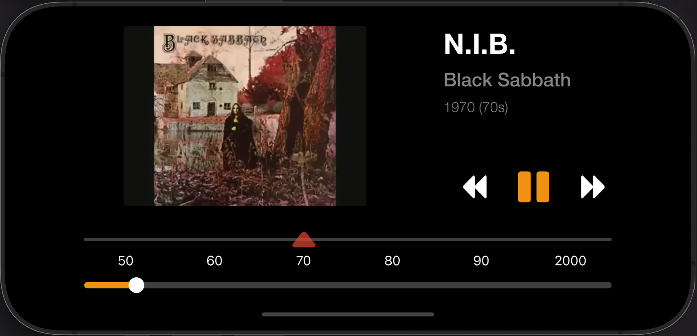
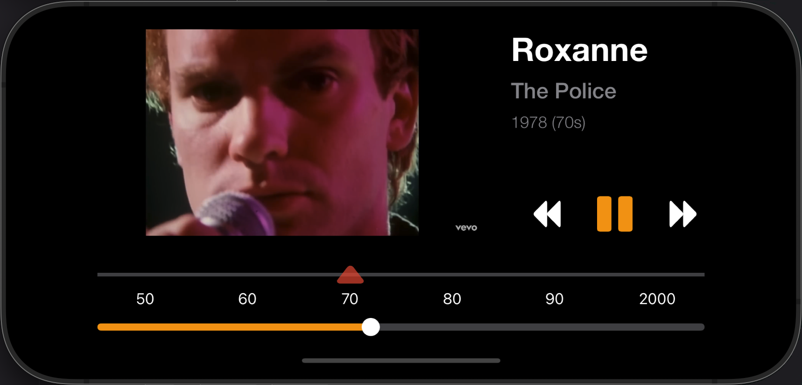

# Vintage Radio App (iOS)

## Showcase

| Black Sabbath - 1970 - N.I.B. | The Police - 1978 - Roxanne | 
|---------|---------|
|  |  |

## Description

Welcome to the Vintage Radio App for iOS! This application brings you a curated collection of classic hits from the 50s, 60s, 70s, 80s, 90s, and 2000s. Experience a nostalgic journey through music with a custom-themed UI that simulates a vintage radio player. The app streams music directly from YouTube.

## Features

- **Decade-Based Playlists:** Select your favorite decade and listen to a shuffled playlist of iconic songs from that era.
- **Custom Player UI:** A unique user interface designed to feel like a vintage radio.
- **Interactive Decade Slider:** A custom slider component to easily switch between decades.
- **YouTube Integration:** Leverages the YouTube IFrame Player API to stream video content.
- **Robust Error Handling:** The player automatically detects unavailable videos and skips to the next song.
- **Built with SwiftUI:** A modern, declarative UI framework for building iOS apps.

## Project Structure

The project is organized into the following main directories:

-   `/data`: Contains the `Song` data model and the `SongParser` for loading song data from the text file.
-   `/resources`: Contains the `ids.txt` data file and the `youtube_player.html` used for the embedded player.
-   `/ui`: Contains all SwiftUI views (`VideoPlayerView`, `DecadeSlider`), the `VideoPlayerViewModel` for state management, and the `YouTubePlayer` wrapper.

## Dependencies

This project is self-contained and does not have any external binary dependencies (like CocoaPods or Swift Package Manager). It uses Apple's standard frameworks (SwiftUI, Foundation, WebKit) and the web-based YouTube IFrame Player API.
